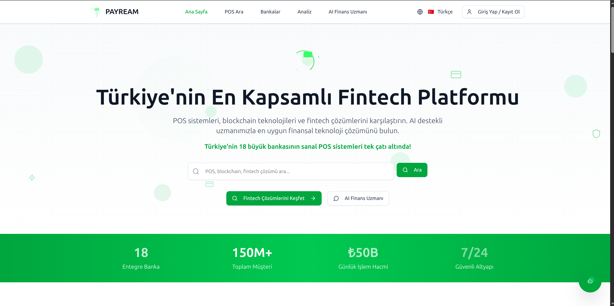
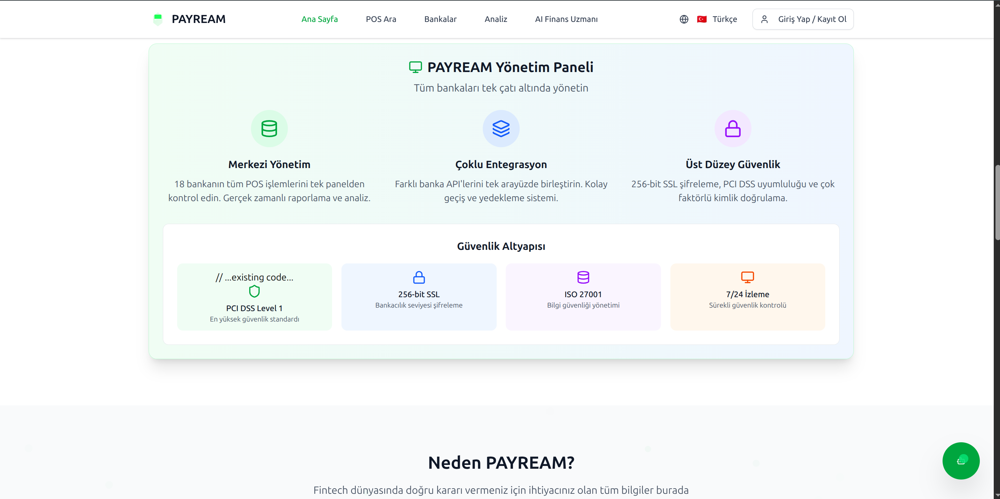
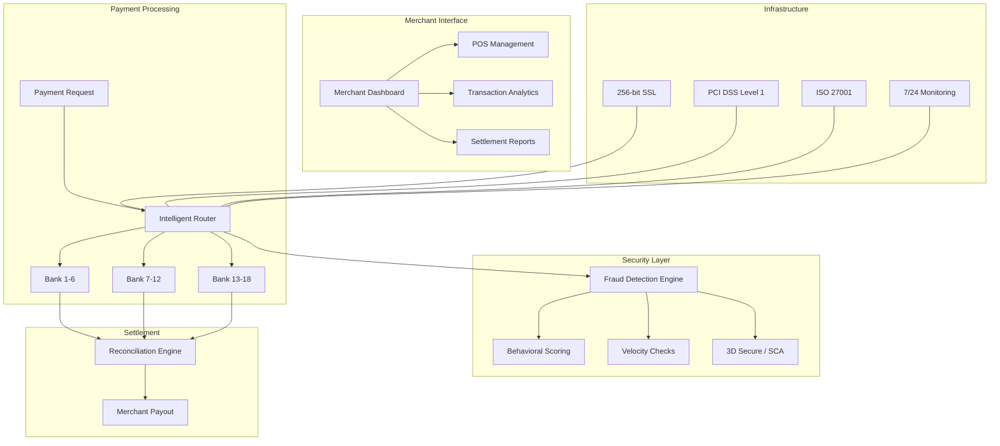

<div align="center">

# Payream

### Turkey's Most Comprehensive Fintech Platform -- 18 Banks, 150M+ Customers, Multi-Gateway Payment Processing with Fraud Detection
### Turkiye'nin En Kapsamli Fintech Platformu -- 18 Banka, 150M+ Musteri, Coklu Gecit Odeme Isleme ve Dolandiricilik Tespiti

[](https://payream.com)
[]()
[]()
[]()

</div>

---

## Preview

<div align="center">
  
  <br><em>18 integrated banks, 150M+ total customers, TL 50B daily transaction volume, 7/24 secure infrastructure</em>
</div>

<br>

<div align="center">
  
  <br><em>Centralized admin panel with multi-bank management, PCI DSS Level 1, 256-bit SSL, ISO 27001, and 7/24 monitoring</em>
</div>

---

## Executive Summary

Payream is Turkey's most comprehensive fintech platform, unifying 18 major banks under a single POS and payment gateway infrastructure serving 150M+ cumulative banking customers. The platform processes TL 50B+ in daily transaction volume with 7/24 uptime, providing merchants with multi-gateway payment routing, intelligent failover, proprietary fraud detection with behavioral scoring, and a complete virtual POS management system.

The platform features a centralized admin panel enabling merchants to manage all 18 bank integrations from a single interface, with real-time transaction analytics, settlement reconciliation, and dispute management. The security infrastructure meets the highest industry standards: PCI DSS Level 1 compliance, 256-bit SSL banking-grade encryption, ISO 27001 information security management, and continuous 24/7 security monitoring.

Built on React 19 + Vite 6.3 frontend with an Encore.dev type-safe backend, Payream's dual revenue model -- 0.5-1.5% transaction fees plus POS SaaS subscriptions ($99-499/month) -- creates compounding revenue growth as merchant transaction volumes scale. The $45B Turkish digital payments market is growing at 30%+ annually, positioning Payream for rapid market capture.

## Yonetici Ozeti

Payream, 18 buyuk bankayi tek bir POS ve odeme gecidi altyapisinda birlestirerek 150M+ toplam bankacilik musterisine hizmet veren Turkiye'nin en kapsamli fintech platformudur. Platform, gunluk 50 milyar TL+ islem hacmi ile 7/24 calisarak, tuccarlarla coklu gecit odeme yonlendirmesi, akilli yedekleme, tescilli dolandiricilik tespiti ve tam sanal POS yonetim sistemi saglar.

Merkezi yonetim paneli, tuccarlarla tum 18 banka entegrasyonunu tek arayuzden yonetme imkani sunar: gercek zamanli islem analitigi, mutabakat ve itiraz yonetimi. Guvenlik altyapisi en yuksek endustri standartlarini karsilar: PCI DSS Seviye 1, 256-bit SSL bankacilik sinifi sifreleme, ISO 27001 ve 7/24 guvenlik izleme.

---

## Key Metrics

| Metric | Value |
|--------|-------|
| Integrated Banks | 18 major Turkish banks |
| Customer Reach | 150M+ cumulative banking customers |
| Daily Transaction Volume | TL 50B+ |
| Uptime | 7/24 (99.99% SLA) |
| Security | PCI DSS Level 1 |
| Encryption | 256-bit SSL banking-grade |
| Compliance | ISO 27001, PCI DSS, KVKK |
| Fraud Detection | Proprietary behavioral scoring |

---

## Revenue Model & Projections

### Business Model

Payream operates on a **dual revenue model**: Transaction fee of 0.5-1.5% per payment processed (scaled by volume), plus POS SaaS subscription tiers -- Starter at $99/month, Business at $249/month, and Enterprise at $499/month.

### 5-Year Revenue Forecast

| Year | Active Merchants | Monthly Volume | ARR | Growth |
|------|-----------------|---------------|-----|--------|
| Y1 | 200 | $5M | $200K | -- |
| Y2 | 800 | $25M | $800K | 300% |
| Y3 | 3,000 | $120M | $3M | 275% |
| Y4 | 8,000 | $400M | $8M | 167% |
| Y5 | 20,000 | $1.2B | $20M | 150% |

---

## Market Opportunity

| Segment | Size |
|---------|------|
| **TAM** (Global Digital Payments Market) | $200B+ by 2030 |
| **SAM** (Turkish Digital Payments Ecosystem) | $45B |
| **SOM** (SME POS + Payment Gateway, Turkey) | $3B |

**Key Differentiators:** Only platform integrating all 18 major Turkish banks under one roof. 150M+ customer reach through bank network effects. PCI DSS Level 1 (highest compliance tier). Proprietary fraud detection with behavioral scoring. Dual revenue model (transaction fees + SaaS) creates compounding growth.

---

## Tech Stack

<div align="center">


| Layer | Technology |
|-------|-----------|
| Frontend | React 19 + Vite 6.3 |
| Language | TypeScript 5.8 (strict mode) |
| Styling | Tailwind CSS 4 + tw-animate-css |
| UI Components | Radix UI (WCAG 2.1 AA) |
| Data Fetching | TanStack Query 5 |
| Charts | Recharts 2 |
| i18n | i18next 25 + react-i18next 15 |
| Backend | Encore.dev (type-safe API) |
| Testing | Vitest 3 + Playwright E2E |
| Package Manager | Bun |
| Intelligence | Proprietary fraud detection engine |

</div>

---

## Competitive Advantages

- **18-Bank Integration Moat** -- Each bank integration takes 3-6 months; competitors cannot replicate this network overnight
- **150M+ Customer Reach** -- Combined customer base of all integrated banks creates unmatched distribution channel
- **PCI DSS Level 1** -- Highest compliance tier; only 1% of payment companies globally achieve Level 1
- **Dual Revenue Model** -- Transaction fees (0.5-1.5%) + SaaS subscriptions ($99-499/mo) create compounding revenue
- **Proprietary Fraud Detection** -- Behavioral scoring engine with velocity checks and rule-based risk assessment

---

## Architecture



---

## Integrated Banks

Payream provides unified access to Turkey's complete banking ecosystem:

| Category | Banks |
|----------|-------|
| State Banks | Ziraat Bankasi, Halkbank, Vakifbank |
| Private Banks | Garanti BBVA, Is Bankasi, Akbank, Yapi Kredi |
| Participation | Kuveyt Turk, Turkiye Finans, Albaraka Turk |
| Digital | ENPARA, Papara, Tosla |
| International | HSBC Turkey, ING Turkey, QNB Finansbank |
| Others | Denizbank, TEB, Sekerbank |

---

## Getting Started

```bash
# Clone the repository
git clone https://github.com/lydianai/Payream.git
cd Payream

# Install dependencies
bun install

# Configure environment
cp .env.example .env
# Set gateway credentials and API keys

# Start backend (Encore.dev)
encore run

# Start frontend (in another terminal)
cd frontend && bun dev
```

---

## Security & Compliance

| Standard | Implementation |
|----------|---------------|
| PCI DSS Level 1 | Highest payment security certification |
| 256-bit SSL | Banking-grade encryption for all data |
| ISO 27001 | Information security management system |
| KVKK | Turkish personal data protection law |
| 3D Secure | Strong Customer Authentication (SCA) |
| Tokenization | No raw card (PAN) data stored |
| TLS 1.3 | All API communications encrypted |
| 7/24 Monitoring | Continuous security operations center |
| OWASP Top 10 | Full mitigation applied |

---

## Contact

| | |
|---|---|
| **Email** | info@ailydian.com |
| **Email** | ailydian@ailydian.com |
| **Web** | [https://ailydian.com](https://ailydian.com) |
| **Platform** | [https://payream.com](https://payream.com) |

---

## License

Copyright (c) 2025-2026 AiLydian. All Rights Reserved.

This software is proprietary and confidential. Unauthorized copying, distribution, or modification is strictly prohibited.
