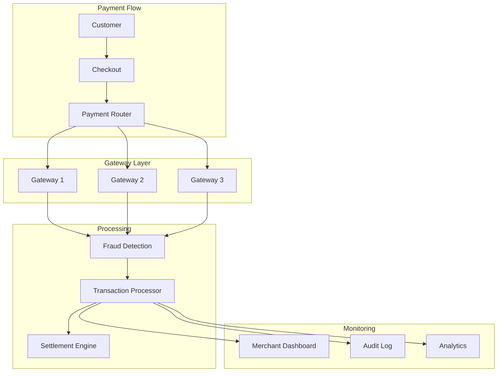

<div align="center">

# Payream

<p><em>Modern Payment Processing Platform with Multi-Gateway Integration and Fraud Detection</em></p>

<p>
  <a href="#overview"></a>
  <a href="#architecture"></a>
  <a href="#key-features"></a>
  <a href="#getting-started"></a>
</p>

<p>
  
  
  
  
  
  
</p>

<table>
<tr>
<td width="50%">

**Platform Highlights**
- Multi-gateway routing with automatic failover across payment processors
- Rule-based and behavioral fraud scoring with velocity checks
- PCI DSS compliant card tokenization with 3D Secure SCA support
- Real-time transaction monitoring and merchant analytics dashboard

</td>
<td width="50%">

**Technical Excellence**
- React 19 + Vite 6.3 frontend with TypeScript strict mode
- Encore.dev type-safe backend with automatic API generation
- TanStack Query 5 for live transaction polling
- Playwright E2E + Vitest unit test coverage for critical payment flows

</td>
</tr>
</table>

</div>

---

## Overview

Payream is a modern payment processing platform providing merchants with multi-gateway integration, real-time transaction monitoring, fraud detection, and comprehensive analytics. Built with a React 19 + Vite frontend and an Encore.dev type-safe backend, the platform delivers PCI DSS compliant payment flows with a premium dashboard experience.

---

## Architecture



---

## Key Features

### Payment Processing
- **Multi-Gateway Integration**: Route payments across multiple payment processors with automatic failover
- **PCI DSS Compliance**: Secure card data handling with tokenization
- **Multi-Currency Support**: Process payments in multiple currencies with real-time FX rates
- **Real-time Status Tracking**: Live transaction status updates via TanStack Query polling

### Security and Fraud Prevention
- **Fraud Detection Engine**: Rule-based and behavioral fraud scoring
- **3D Secure Support**: SCA-compliant authentication for EU/UK markets
- **Risk Scoring**: Per-transaction risk assessment with configurable thresholds
- **Velocity Checks**: Rate limiting per card, IP, and merchant

### Merchant Dashboard
- **Transaction Analytics**: Recharts-powered visualization of payment volume, success rates, and revenue
- **Settlement Reporting**: Daily and monthly settlement reconciliation
- **Dispute Management**: Chargeback workflow with evidence submission
- **API Key Management**: Secure key generation and rotation

### Platform Features
- **Multi-Language**: i18next + react-i18next with browser language detection
- **Accessibility**: Radix UI primitives for WCAG 2.1 AA compliance
- **E2E Testing**: Playwright test suite for critical payment flows
- **Unit Testing**: Vitest with React Testing Library

---

## Technology Stack

<div align="center">

| Layer | Technology | Badge |
|-------|------------|-------|
| Frontend Framework | React 19.1, React Router 7 |  |
| Language | TypeScript 5.8 |  |
| Build Tool | Vite 6.3, Bun |  |
| Styling | Tailwind CSS 4, tw-animate-css |  |
| UI Components | Radix UI |  |
| Data Fetching | TanStack Query 5 |  |
| Charts | Recharts 2 |  |
| i18n | i18next 25, react-i18next 15 |  |
| Backend | Encore.dev (type-safe API) |  |
| Testing | Vitest 3, Playwright |  |
| Package Manager | Bun |  |

</div>

---

## Project Structure

```
Payream/
├── frontend/               # React + Vite frontend
│   ├── src/
│   │   ├── components/     # Radix UI-based components
│   │   ├── pages/          # Route page components
│   │   ├── hooks/          # TanStack Query hooks
│   │   ├── lib/            # Utilities and helpers
│   │   └── i18n/           # Translation files
│   ├── e2e/                # Playwright end-to-end tests
│   └── vite.config.ts      # Vite configuration
├── backend/                # Encore.dev backend services
│   ├── payments/           # Payment processing service
│   ├── fraud/              # Fraud detection service
│   ├── merchants/          # Merchant management service
│   └── settlements/        # Settlement processing service
├── playwright.config.ts    # E2E test configuration
├── vitest.config.ts        # Unit test configuration
└── package.json            # Workspace root
```

---

## Getting Started

### Prerequisites

- [Bun](https://bun.sh) 1.0+
- [Encore CLI](https://encore.dev/docs/install)
- Node.js 20+ (for tooling compatibility)

### Installation

```bash
# Clone the repository
git clone https://github.com/lydianai/Payream.git
cd Payream

# Install all workspace dependencies
bun install

# Configure environment
cp .env.example .env
# Edit .env with your payment gateway credentials

# Start the backend (Encore.dev)
encore run

# Start the frontend (in another terminal)
cd frontend
bun dev
```

### Environment Variables

```env
# Payment Gateways
GATEWAY_1_API_KEY=your_key_here
GATEWAY_1_SECRET=your_secret_here

GATEWAY_2_API_KEY=your_key_here
GATEWAY_2_SECRET=your_secret_here

# Fraud Detection
FRAUD_SERVICE_URL=https://...
FRAUD_SERVICE_KEY=your_key_here

# Application
VITE_API_BASE_URL=http://localhost:4000
VITE_APP_ENV=development
```

### Running Tests

```bash
# Unit tests
bun run test

# E2E tests (requires running app)
bun run playwright test

# Type checking
bun run typecheck
```

### Build for Production

```bash
# Build frontend
cd frontend && bun run build

# Deploy backend
encore deploy
```

---

## Dashboard Views

| View | Description |
|------|-------------|
| Overview | Real-time KPIs: volume, success rate, avg. ticket |
| Transactions | Filterable transaction list with status badges |
| Analytics | Time-series revenue charts and conversion funnels |
| Settlements | Daily settlement reports with reconciliation |
| Disputes | Chargeback management and evidence submission |
| Settings | API keys, webhook endpoints, team management |

---

## Security

Payment systems require the highest security standards. See [SECURITY.md](SECURITY.md) for vulnerability reporting procedures.

Key security implementations:
- PCI DSS compliant data handling
- Card number tokenization (no raw PAN storage)
- TLS 1.3 for all API communication
- OWASP Top 10 2025 protections
- Comprehensive audit logging

---

## License

Copyright (c) 2024-2026 Lydian (AiLydian). All Rights Reserved.

This software is proprietary. See [LICENSE](LICENSE) for details.

---

## Links

- **Main Website**: [www.ailydian.com](https://www.ailydian.com)
- **Email**: [contact@ailydian.com](mailto:contact@ailydian.com)
- **Security Policy**: [SECURITY.md](SECURITY.md)
